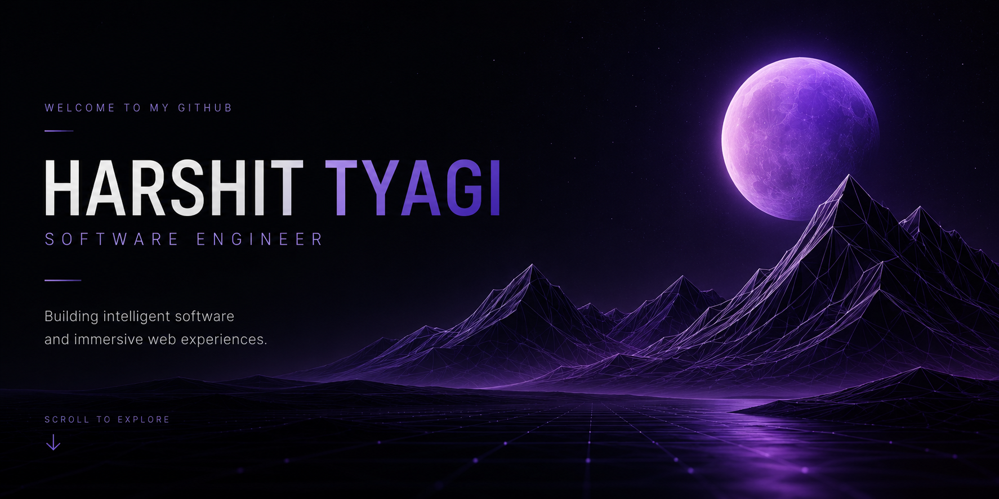

<!-- ===================================================== -->
<!--                     HERO                              -->
<!-- ===================================================== -->

<p align="center">
  
</p>

<h1 align="center">Harshit Tyagi</h1>

<p align="center">
  <b>Software Engineer • Full Stack Developer • AI Developer</b>
</p>

<p align="center">
Building intelligent software, AI-powered applications and immersive web experiences.
</p>

<p align="center">

<a href="#">

</a>

<a href="#">

</a>

<a href="#">

</a>

<a href="mailto:YOUR_EMAIL@gmail.com">

</a>

</p>

---

# Selected Work

<p align="center">

A collection of projects exploring Artificial Intelligence, Full Stack Engineering and Interactive Graphics.

</p>

<br>

<table width="100%">

<tr>

<td width="48%" valign="top">


<h3>CHITEASE</h3>

<b>AI-powered Digital Chit Fund Platform</b>

Modernizing traditional chit fund management through secure digital workflows, intelligent automation and AI-assisted verification.

<br>


<br><br>

<a href="https://github.com/Harshit07ank">

Repository →

</a>

</td>

<td width="4%"></td>

<td width="48%" valign="top">


<h3>IRIS</h3>

<b>Vision Through Voice</b>

Accessibility platform combining multimodal AI, speech recognition and intelligent voice interactions.

<br>


<br><br>

<a href="https://github.com/Harshit07ank">

Repository →

</a>

</td>

</tr>

</table>

<br>

<table width="100%">

<tr>

<td width="48%" valign="top">

<div align="center">


<h3>Interactive Portfolio</h3>

Story-driven portfolio built with immersive animations, procedural environments and modern web technologies.

<br>


<br><br>

<b>Launching Soon</b>

</div>

</td>

<td width="4%"></td>

<td width="48%" valign="top">

<div align="center">


<h3>Procedural World Engine</h3>

Graphics experiments exploring terrain generation, shaders, rendering optimization and procedural systems.

<br>


<br><br>

<b>Research Project</b>

</div>

</td>

</tr>

</table>

---

<p align="center">

<i>

Every project represents another step toward building thoughtful, scalable and meaningful software.

</i>

</p>

---
---

# Engineering Journey

```text
2023 ────────────── 2024 ────────────── 2025 ────────────── 2026

C & Java      Web Development      AI & Full Stack      Interactive Graphics
```

Started with programming fundamentals, transitioned into full stack development, explored AI-powered applications, and now building immersive web experiences with modern graphics technologies.

---

# Engineering Toolbox

### Languages

<p align="center">

</p>

### Frontend

<p align="center">

</p>

### Backend

<p align="center">

</p>

### Graphics

<p align="center">

</p>

<p align="center">
<sub>WebGL • GLSL • Procedural Generation • Rendering Optimization</sub>
</p>

### Artificial Intelligence

<p align="center">
<sub>Gemini API • Prompt Engineering • RAG • AI Integration</sub>
</p>

### Development Tools

<p align="center">

</p>

---

# What I Build

<table width="100%">
<tr>

<td width="33%" valign="top">

### Full Stack

Modern web applications built with React, Next.js, Node.js, MongoDB and Firebase.

</td>

<td width="33%" valign="top">

### Artificial Intelligence

AI-powered applications using Gemini, Prompt Engineering, RAG and workflow automation.

</td>

<td width="33%" valign="top">

### Interactive Graphics

Three.js experiences, procedural worlds, WebGL experiments and rendering optimization.

</td>

</tr>
</table>

---


---
---

# GitHub Analytics

<p align="center">


</p>

<p align="center">


</p>

---

# Contribution Activity

<p align="center">


</p>

---

# Contribution Snake

<p align="center">


</p>

---

# 2026 Roadmap

- [x] Build AI-powered projects
- [x] Develop production-ready full stack applications
- [ ] Launch Interactive Portfolio
- [ ] Complete Procedural World Engine
- [ ] Contribute to Open Source
- [ ] Master Backend System Design
- [ ] Explore Advanced WebGL & Graphics Programming

---

# Currently Exploring

- Software Architecture
- Distributed Systems
- Performance Optimization
- WebGL & GLSL
- Procedural Graphics
- Three.js Ecosystem
- Cloud Deployment

---

# Let's Connect

<p align="center">

<a href="#">

</a>

<a href="#">

</a>

<a href="#">

</a>

<a href="mailto:YOUR_EMAIL@gmail.com">

</a>

</p>

---

<p align="center">

<i>

"Great software is built through curiosity, consistency, and continuous learning."

</i>

<br><br>

<sub>

Designed & Maintained by <b>Harshit Tyagi</b>

</sub>

</p>
