```mermaid
%%{init: {"flowchart": {"wrappingWidth": 650, "nodeSpacing": 12, "rankSpacing": 18, "curve": "basis"}}}%%
flowchart TD

    title["`**ENGINEERING JOURNEY**
    *A path of curiosity, building and continuous learning*`"]

    subgraph card2022 [" "]
        direction TD
        Y2022_head["`**2022 — The Beginning**`"]
        Y2022_intro["`Started my programming journey during my first year of engineering. Experimented with Python and a little bit of C while learning programming fundamentals.`"]
        Y2022_details["`**Focus:** Python • C Programming • Problem Solving
        **Built:** Small Projects • CLI Programs • Logic Building
        **Learned:** Programming Basics • Computational Thinking • Learning by Building`"]
        Y2022_head ~~~ Y2022_intro ~~~ Y2022_details
    end

    subgraph card2023 [" "]
        direction TD
        Y2023_head["`**2023 — Fell into JavaScript**`"]
        Y2023_intro["`JavaScript completely changed how I looked at software development. The ability to build interactive experiences on the web fascinated me.`"]
        Y2023_details["`**Focus:** JavaScript • Web Development • Interactive UI
        **Built:** Frontend Projects • UI Components • JS Experiments
        **Learned:** Modern JavaScript • DOM Manipulation • Project Based Learning`"]
        Y2023_head ~~~ Y2023_intro ~~~ Y2023_details
    end

    subgraph card2024 [" "]
        direction TD
        Y2024_head["`**2024 — Building Across the Stack**`"]
        Y2024_intro["`Started exploring backend development, APIs, Node.js, Three.js and AI integrations. This was when I became interested in creative technology.`"]
        Y2024_details["`**Focus:** Node.js • Three.js • AI Integration
        **Built:** 3D Experiments • REST APIs • Procedural Animations
        **Learned:** Backend Concepts • API Development • Creative Coding`"]
        Y2024_head ~~~ Y2024_intro ~~~ Y2024_details
    end

    subgraph card2025 [" "]
        direction TD
        Y2025_head["`**2025 — AI + Full Stack + Creative Tech**`"]
        Y2025_intro["`Spent most of my time building AI-powered applications and learning how modern software systems are designed. Explored Firebase and scalable backend services.`"]
        Y2025_details["`**Focus:** AI Integrations • Backend Systems • Cloud Services
        **Built:** IRIS Platform • Firebase Apps • 3D Experiments
        **Learned:** AI Workflows • API Design • Modern JS Tooling`"]
        Y2025_head ~~~ Y2025_intro ~~~ Y2025_details
    end

    subgraph card2026 [" "]
        direction TD
        Y2026_head["`**2026 — Engineering Bigger Systems**`"]
        Y2026_intro["`Graduated with a B.Tech in Computer Science Engineering and became interested in building software systems that combine AI, backend architecture and interactive experiences.`"]
        Y2026_details["`**Focus:** System Architecture • Distributed Systems • Performance
        **Built:** CHITEASE Platform • RAG Applications • Interactive Portfolios
        **Learned:** Docker • CI/CD Pipelines • Backend Engineering`"]
        Y2026_head ~~~ Y2026_intro ~~~ Y2026_details
    end

    subgraph cardnow [" "]
        direction TD
        NOW_head["`**NOW — What's Next?**`"]
        NOW_intro["`Exploring how scalable backend systems, AI workflows and interactive technologies can work together to build meaningful products and creative experiences.`"]
        NOW_details["`Software Architecture • Distributed Systems • CI/CD Pipelines • AI Workflows • Performance Optimization • Cloud & DevOps • Creative Tech`"]
        NOW_head ~~~ NOW_intro ~~~ NOW_details
    end

    footer["`Every project teaches me something new.
    *The journey continues.*`"]

    title --> Y2022_head
    Y2022_details ----> Y2023_head
    Y2023_details ----> Y2024_head
    Y2024_details ----> Y2025_head
    Y2025_details ----> Y2026_head
    Y2026_details ----> NOW_head
    NOW_details ----> footer

    classDef y2022head fill:#6d28d9,stroke:#6d28d9,color:#fff,font-size:18px,text-align:left
    classDef y2022intro fill:#4c1d95,stroke:#6d28d9,stroke-width:2px,color:#f3ecff,font-size:15px,text-align:left
    classDef y2022details fill:#2e1065,stroke:#6d28d9,stroke-width:2px,color:#f3ecff,font-size:15px,text-align:left

    classDef y2023head fill:#be185d,stroke:#be185d,color:#fff,font-size:18px,text-align:left
    classDef y2023intro fill:#831843,stroke:#be185d,stroke-width:2px,color:#fde8f1,font-size:15px,text-align:left
    classDef y2023details fill:#500724,stroke:#be185d,stroke-width:2px,color:#fde8f1,font-size:15px,text-align:left

    classDef y2024head fill:#6d28d9,stroke:#6d28d9,color:#fff,font-size:18px,text-align:left
    classDef y2024intro fill:#4c1d95,stroke:#6d28d9,stroke-width:2px,color:#f3ecff,font-size:15px,text-align:left
    classDef y2024details fill:#2e1065,stroke:#6d28d9,stroke-width:2px,color:#f3ecff,font-size:15px,text-align:left

    classDef y2025head fill:#0f766e,stroke:#0f766e,color:#fff,font-size:18px,text-align:left
    classDef y2025intro fill:#134e4a,stroke:#0f766e,stroke-width:2px,color:#e0fbf6,font-size:15px,text-align:left
    classDef y2025details fill:#042f2e,stroke:#0f766e,stroke-width:2px,color:#e0fbf6,font-size:15px,text-align:left

    classDef y2026head fill:#6d28d9,stroke:#6d28d9,color:#fff,font-size:18px,text-align:left
    classDef y2026intro fill:#4c1d95,stroke:#6d28d9,stroke-width:2px,color:#f3ecff,font-size:15px,text-align:left
    classDef y2026details fill:#2e1065,stroke:#6d28d9,stroke-width:2px,color:#f3ecff,font-size:15px,text-align:left

    classDef nowhead fill:#c2410c,stroke:#c2410c,color:#fff,font-size:18px,text-align:left
    classDef nowintro fill:#7c2d12,stroke:#c2410c,stroke-width:2px,color:#ffe8dc,font-size:15px,text-align:left
    classDef nowdetails fill:#431407,stroke:#c2410c,stroke-width:2px,color:#ffe8dc,font-size:15px,text-align:left

    classDef titleStyle fill:none,stroke:none,color:#fff,font-size:20px
    classDef footerStyle fill:none,stroke:none,color:#aaa,font-size:14px

    classDef card2022style fill:none,stroke:#6d28d9,stroke-width:2px
    classDef card2023style fill:none,stroke:#be185d,stroke-width:2px
    classDef card2024style fill:none,stroke:#6d28d9,stroke-width:2px
    classDef card2025style fill:none,stroke:#0f766e,stroke-width:2px
    classDef card2026style fill:none,stroke:#6d28d9,stroke-width:2px
    classDef cardnowstyle fill:none,stroke:#c2410c,stroke-width:2px

    class Y2022_head y2022head
    class Y2022_intro y2022intro
    class Y2022_details y2022details
    class Y2023_head y2023head
    class Y2023_intro y2023intro
    class Y2023_details y2023details
    class Y2024_head y2024head
    class Y2024_intro y2024intro
    class Y2024_details y2024details
    class Y2025_head y2025head
    class Y2025_intro y2025intro
    class Y2025_details y2025details
    class Y2026_head y2026head
    class Y2026_intro y2026intro
    class Y2026_details y2026details
    class NOW_head nowhead
    class NOW_intro nowintro
    class NOW_details nowdetails

    class title titleStyle
    class footer footerStyle

    class card2022 card2022style
    class card2023 card2023style
    class card2024 card2024style
    class card2025 card2025style
    class card2026 card2026style
    class cardnow cardnowstyle
```

<p align="center">
  
</p>
<!-- Name -->

<!-- Title -->
<h3 align="LEFT">
    <samp>
        > Hey There!, I am
        <b><a target="_blank" href="https://www.linkedin.com/in/harshit-tyagi-07ank">HARSHIT TYAGI</a></b>
    </samp>
</h3>

<p align="center">
<samp>
「 Building intelligent systems, immersive experiences, and modern software architectures 」
</samp>
</p>

<!-- Introduction -->

<p align="center">
  Computer Science Engineering Student passionate about building immersive web experiences,<br>
  scalable backend systems, real-time applications, and AI-powered products.
</p>

<p align="center">
  Currently learning, experimenting, and turning ideas into interactive projects.
</p>

<!-- Tech Interests -->

<p align="center">
  
  
  
  
</p>
<p align="center">
  
</p>
## Selected Work

<table>
<tr>
<td width="50%" valign="top">

### 🔗 [CHITEASE](https://github.com/Harshit07ank/CHITEASE)
**AI-powered digital chit fund platform**

Modernizes traditional chit fund management with secure digital workflows, automation, and AI-assisted verification.

`JavaScript` `MERN` `AI Integration`

</td>
<td width="50%" valign="top">

### 🔗 [IRIS](https://github.com/Harshit07ank/IRIS)
**Vision through voice**

Accessibility platform combining multimodal AI, speech recognition, and voice interaction.

`JavaScript` `Gemini API` `Accessibility`

</td>
</tr>
<tr>
<td width="50%" valign="top">

### 🚧 Interactive Portfolio
**In progress**

Story-driven portfolio built with procedural environments and immersive animation — the proving ground for the Three.js graphics work.

`Three.js` `WebGL` `GLSL`

</td>
<td width="50%" valign="top">

### 🚧 Procedural World Engine
**Early-stage**

Graphics experiments in terrain generation, shaders, and rendering optimization.

`WebGL` `GLSL` `Procedural Generation`

</td>
</tr>
</table>

<br/>

## Engineering Journey

```
2023              2024                2025                 2026
 │                  │                   │                    │
 C & Java ──── Web Development ──── AI & Full Stack ──── Interactive Graphics
```

Started with programming fundamentals → moved into full stack development → explored AI-powered applications → now building real-time graphics and shader-driven experiences.

<br/>

## Toolbox

<div align="center">


<br/><br/>

**Graphics:** WebGL · GLSL · Three.js · Procedural Generation · Rendering Optimization
**AI:** Gemini API · Prompt Engineering · RAG · AI Integration
**Currently exploring:** Software Architecture · Distributed Systems · Performance Optimization · Cloud Deployment

</div>

<br/>

## GitHub Stats

<div align="center">


<br/>


</div>

<br/>

## Connect

<div align="center">

<!-- Replace the # links below with your actual profiles -->
<a href="#"></a>
<a href="#"></a>
<a href="mailto:#"></a>

<br/><br/>

<sub>Great software is built through curiosity, consistency, and continuous learning.</sub>

</div>




