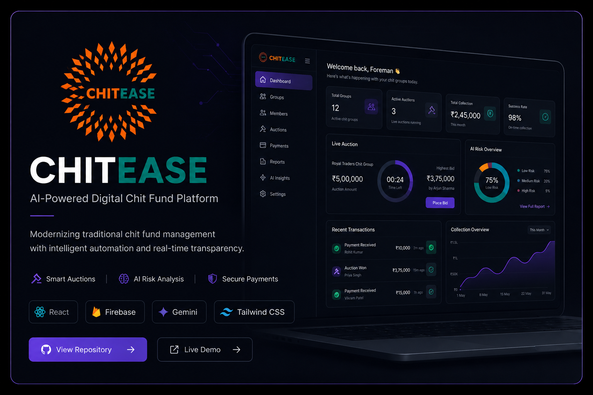
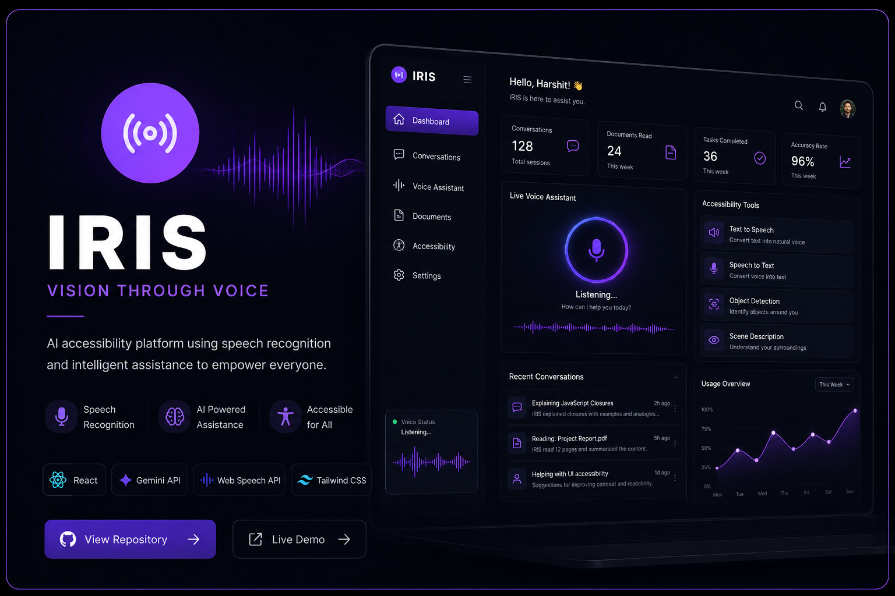
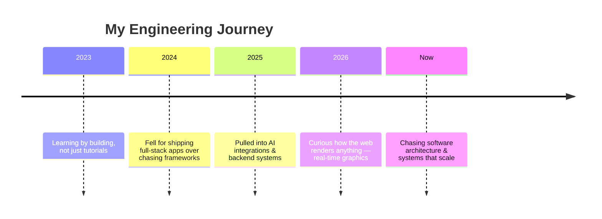
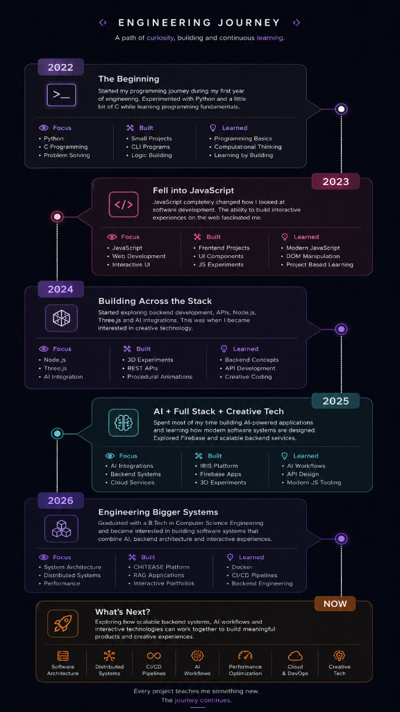

  

   

  
  

    

  **[🧠 Mindset](#engineering-mindset) · [🛠️ Log](#engineering-log) · [💼 Work](#selected-work) · [🗺️ Journey](#engineering-journey) · [🧰 Toolbox](#toolbox) · [📊 Stats](#github-stats) · [🔭 Exploring](#things-im-exploring) · [🤝 Connect](#connect)**

---

## 🧠 Engineering Mindset

> 💡 **I learn best by building.**
> Usually by picking something a bit too hard and figuring out how it actually works, not just how to use it. 
> Most of what I build lives in the JavaScript ecosystem: backend systems, AI integrations, software design, and interactive experiences.

 

## 🛠️ Engineering Log

> 🚀 **Right now:** Real-time water simulation in Three.js — `InstancedMesh` particles with a custom `ShaderMaterial` for streak rendering. 
> 
> *I picked it to force myself into shader math and performance work that typical backend projects don't demand.*
> 
> **Current problem:** Keeping turbulence and splash timing convincing without tanking frame time at thousands of particles.

 

## 💼 Selected Work

**🔗 [CHITEASE](https://github.com/Harshit07ank/CHITEASE)**
 

 
*AI-powered digital chit fund platform — secure workflows, automation, and AI-assisted verification for traditional chit funds.*
 
  

 

**🔗 [IRIS](https://github.com/Harshit07ank/IRIS)**
 

 
*Vision through voice — an accessibility platform combining multimodal AI, speech recognition, and voice interaction.*
 
  

 

**🚧 Interactive Portfolio** — *in progress*
 
*Story-driven portfolio with procedural environments; the proving ground for rendering work.*
 
  

 

**🚧 Procedural World Engine** — *early-stage*
 
*Terrain generation, shaders, and rendering-optimization experiments.*
 
  

 

## 🗺️ Engineering Journey

<strong>✨ View Detailed Visual Timeline</strong>

 

  

 

**What's next?**
 

  
  
  
  
  
  
  
  

 

## 🧰 Toolbox

  

<strong>🎨 Creative Tech</strong>

 

<strong>🖥️ Front End</strong>

 

<strong>⚙️ Backend &amp; Database</strong>

 

<strong>☁️ Cloud &amp; DevOps</strong>

 

<strong>🧠 Languages</strong>

 

 

## 📊 GitHub Stats

 

  

 

## 🔭 Things I'm Exploring

> Topics I keep coming back to, outside of what I'm actively shipping:

**Software Architecture** · **Distributed Systems** · **CI/CD Pipelines** · **AI Workflows** · **Backend Systems** · **Performance Optimization** · **Interactive Experiences** · **Cloud Deployment**

 

## 🤝 Connect

 

