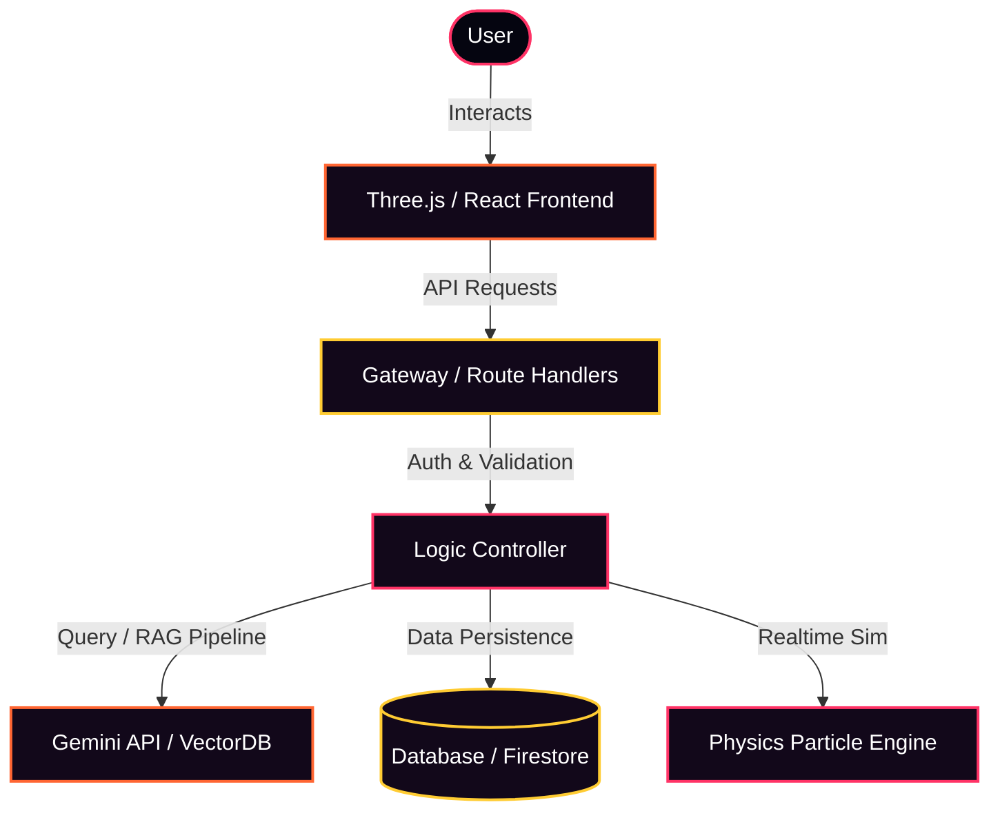
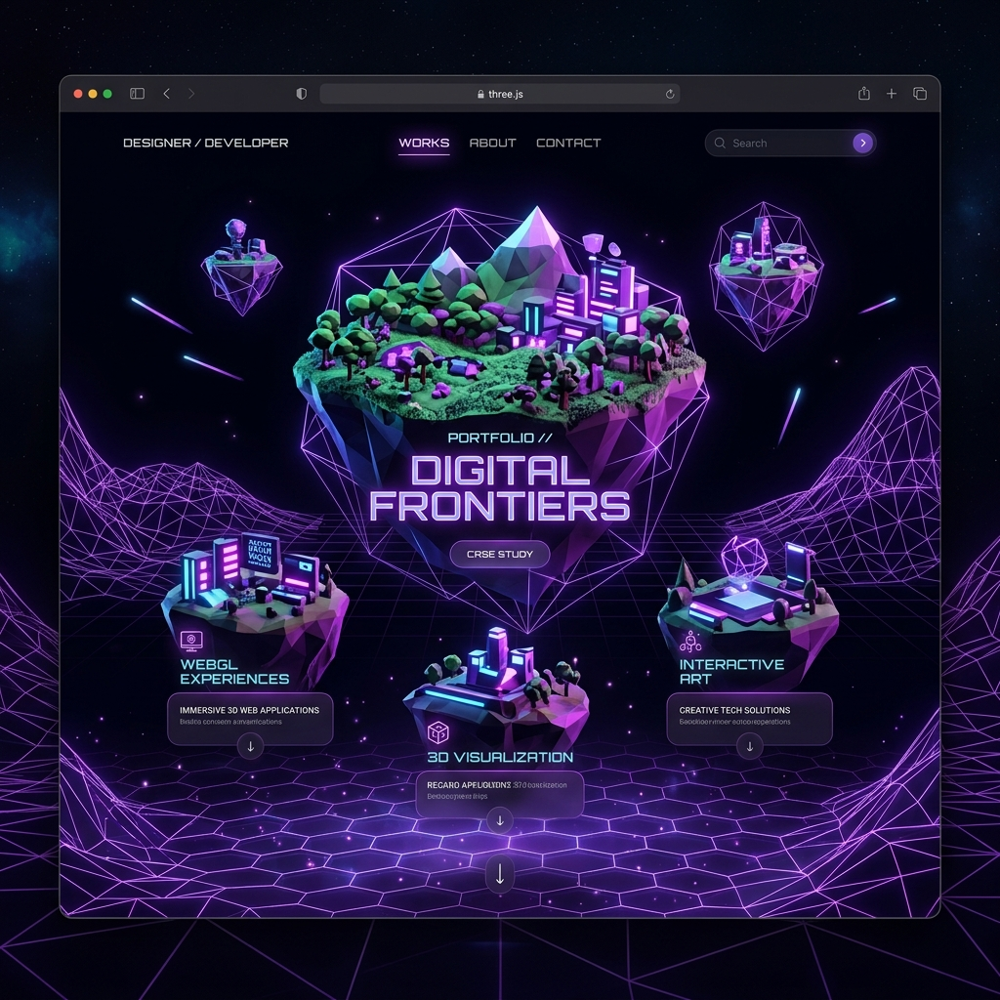
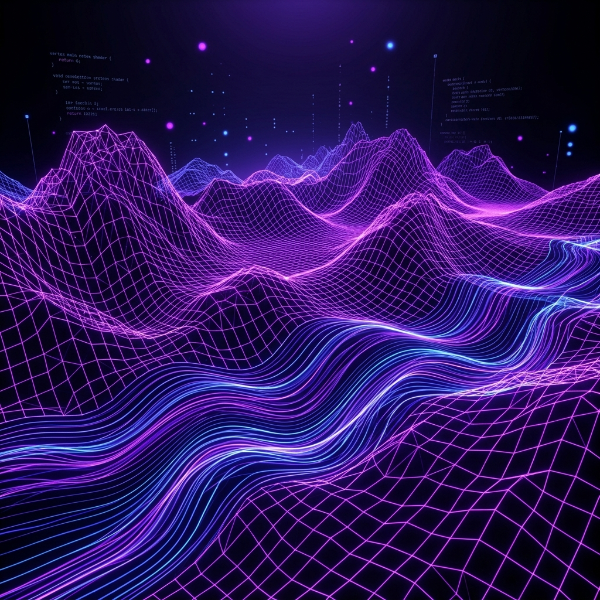
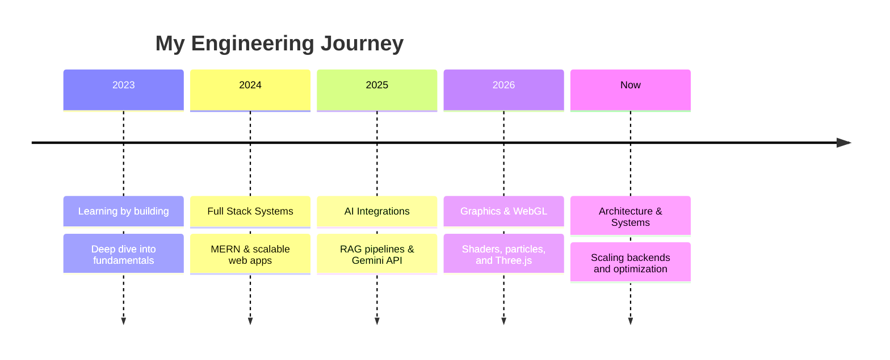

  

    

  
  

    

  **[🧠 Mindset](#engineering-mindset) · [🛠️ Log](#engineering-log) · [💼 Work](#selected-work) · [🗺️ Journey](#engineering-journey) · [🧰 Toolbox](#toolbox) · [📊 Stats](#github-stats) · [🔭 Exploring](#things-im-exploring) · [🤝 Connect](#connect)**

---

## 🧠 Engineering Mindset

I learn best by building — usually by picking something a bit too hard and figuring out how it actually works, not just how to use it. Most of what I build lives in the JavaScript ecosystem: backend systems, AI integrations, software design, and interactive experiences.

### Mindset & Flow Architecture

Below is a system architecture map of how I approach structuring and orchestrating applications from backend to interactive frontend:

 

## 🛠️ Engineering Log

Right now: a real-time water simulation in Three.js — `InstancedMesh` particles with a custom `ShaderMaterial` for streak rendering. I picked it to force myself into shader math and performance work that typical backend projects don't demand.

Current problem: keeping turbulence and splash timing convincing without tanking frame time at thousands of particles.

 

## 💼 Selected Work

**🔗 [CHITEASE](https://github.com/Harshit07ank/CHITEASE)**
 

 
AI-powered digital chit fund platform — secure workflows, automation, and AI-assisted verification for traditional chit funds.
 
  

 

**🔗 [IRIS](https://github.com/Harshit07ank/IRIS)**
 

 
Vision through voice — an accessibility platform combining multimodal AI, speech recognition, and voice interaction.
 
  

 

**🚧 Interactive Portfolio** — *in progress*
 

 
Story-driven portfolio with procedural environments; the proving ground for the rendering work above.
 
  

 

**🚧 Procedural World Engine** — *early-stage*
 

 
Terrain generation, shaders, and rendering-optimization experiments.
 
  

 

## 🗺️ Engineering Journey

<strong>🌅 View Visual Timeline</strong>

 

  

 

**What's next?**
 

  
  
  
  
  
  
  
  

 

## 🧰 Toolbox

  

    

  

    
<strong>🎨 Creative Tech Stack</strong>

     
    

      
      
      
      
      
    

  

  

    
<strong>🖥️ Front End Stack</strong>

     
    

      
      
      
      
      
    

  

  

    
<strong>⚙️ Backend &amp; Database</strong>

     
    

      
      
      
      
      
      
    

  

  

    
<strong>☁️ Cloud &amp; DevOps</strong>

     
    

      
      
      
      
    

  

  

    
<strong>🧠 Programming Languages</strong>

     
    

      
      
      
      
      
    

  

 

## 📊 GitHub Stats

  
  
   
  

    

  

 

## 🔭 Things I'm Exploring

> Topics I keep coming back to, outside of what I'm actively shipping:

**Software Architecture** · **Distributed Systems** · **CI/CD Pipelines** · **AI Workflows** · **Backend Systems** · **Performance Optimization** · **Interactive Experiences** · **Cloud Deployment**

 

## 🤝 Connect

  
  
  

 

