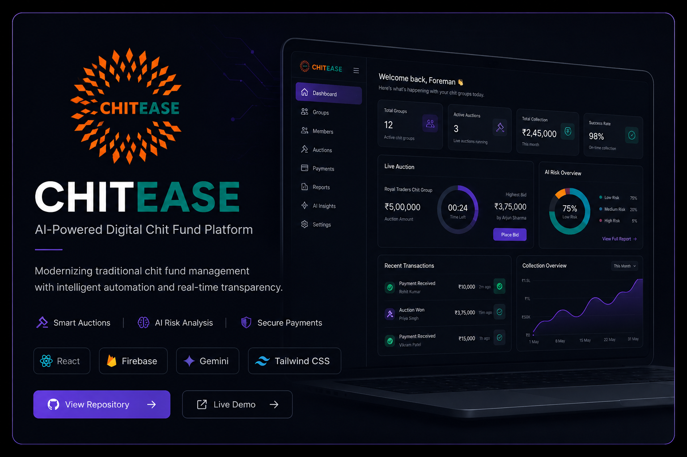
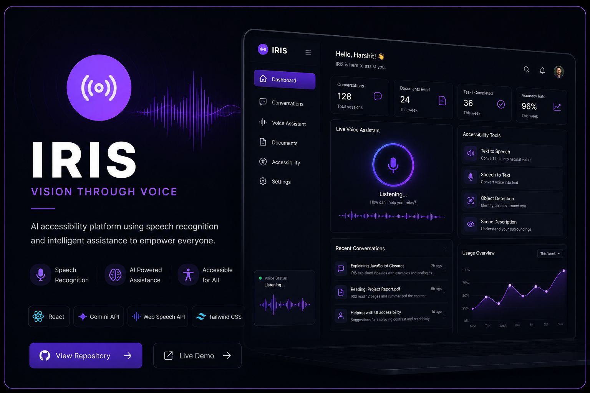

<!-- ============ HEADER ============ -->

<h3 align="center">
  <samp>
    > Hey There!, I am
    <b><a target="_blank" color="7DD3FC" href="https://www.linkedin.com/in/harshit-tyagi-07ank">HARSHIT TYAGI</a></b>
  </samp>
</h3>

  

  From AI-powered applications to immersive web experiences, I enjoy building software that combines thoughtful design,  scalable architecture, and modern web technologies. 
<samp>Currently exploring <b>Three.js</b>, <b>WebGL</b>, <b>distributed systems</b>, and <b>cloud-native development</b>.</samp>

<!-- ============ CONNECT (moved to the top, as requested) ============ -->

 

> CS graduate from India. 
> Building interactive web experiences, backend systems and AI products.

I enjoy building software where graphics, systems and AI meet. 
Currently exploring Three.js, shaders, distributed systems and modern backend 
architecture while shipping projects that solve real problems.  

<h2> Selected Work</h2>

### **CHITEASE**
<samp>MERN · Firebase · AI</samp> 
AI-powered digital chit fund platform focused on secure workflows,
automation, digital auctions, payments and intelligent verification. 
**→ Repository:** https://github.com/Harshit07ank/CHITEASE

 

<!-- IRIS -->

### **IRIS**
<samp>JavaScript · Gemini API · Accessibility</samp> 
Accessibility platform combining multimodal AI,
speech recognition, voice interaction, and intelligent assistance
for visually impaired users.
 
**→ Repository:** https://github.com/Harshit07ank/IRIS

 

<!-- Interactive Portfolio -->

### **Interactive Portfolio**
<samp>Three.js · React · GLSL · WebGL</samp> 
A story-driven developer portfolio featuring procedural environments,
custom shaders, immersive animations, and interactive 3D experiences.
 
**→ Repository:** Coming Soon

 

<!-- Procedural World Engine -->

### **Procedural World Engine**
<samp>Three.js · WebGL · GLSL · Rendering</samp> 
Graphics research exploring procedural terrain generation,
real-time rendering, optimization techniques, and shader programming.
 
**→ Repository:** Coming Soon

 

<!-- ============ TECH STACK ============ -->

##  TECH STACK

 

 

 

  

 
   
   
  
  
   

<!-- ============ ENGINEERING JOURNEY ============ -->

##  Engineering Journey

➜

➜

➜

➜

<samp>Fundamentals → full stack → AI-powered apps → real-time graphics & shader-driven experiences.</samp>

<b> See the full journey</b>

```mermaid
%%{init: {"flowchart": {"wrappingWidth": 650, "nodeSpacing": 12, "rankSpacing": 18, "curve": "basis"}}}%%
flowchart TD

    title["`**ENGINEERING JOURNEY**
    *A path of curiosity, building and continuous learning*`"]

    subgraph card2022 [" "]
        direction TD
        Y2022_head["`**2022 — The Beginning**`"]
        Y2022_intro["`Started my programming journey during my first year of engineering. Experimented with Python and a little bit of C while learning programming fundamentals.`"]
        Y2022_details["`**Focus:** Python • C Programming • Problem Solving
        **Built:** Small Projects • CLI Programs • Logic Building
        **Learned:** Programming Basics • Computational Thinking • Learning by Building`"]
        Y2022_head ~~~ Y2022_intro ~~~ Y2022_details
    end

    subgraph card2023 [" "]
        direction TD
        Y2023_head["`**2023 — Fell into JavaScript**`"]
        Y2023_intro["`JavaScript completely changed how I looked at software development. The ability to build interactive experiences on the web fascinated me.`"]
        Y2023_details["`**Focus:** JavaScript • Web Development • Interactive UI
        **Built:** Frontend Projects • UI Components • JS Experiments
        **Learned:** Modern JavaScript • DOM Manipulation • Project Based Learning`"]
        Y2023_head ~~~ Y2023_intro ~~~ Y2023_details
    end

    subgraph card2024 [" "]
        direction TD
        Y2024_head["`**2024 — Building Across the Stack**`"]
        Y2024_intro["`Started exploring backend development, APIs, Node.js, Three.js and AI integrations. This was when I became interested in creative technology.`"]
        Y2024_details["`**Focus:** Node.js • Three.js • AI Integration
        **Built:** 3D Experiments • REST APIs • Procedural Animations
        **Learned:** Backend Concepts • API Development • Creative Coding`"]
        Y2024_head ~~~ Y2024_intro ~~~ Y2024_details
    end

    subgraph card2025 [" "]
        direction TD
        Y2025_head["`**2025 — AI + Full Stack + Creative Tech**`"]
        Y2025_intro["`Spent most of my time building AI-powered applications and learning how modern software systems are designed. Explored Firebase and scalable backend services.`"]
        Y2025_details["`**Focus:** AI Integrations • Backend Systems • Cloud Services
        **Built:** IRIS Platform • Firebase Apps • 3D Experiments
        **Learned:** AI Workflows • API Design • Modern JS Tooling`"]
        Y2025_head ~~~ Y2025_intro ~~~ Y2025_details
    end

    subgraph card2026 [" "]
        direction TD
        Y2026_head["`**2026 — Engineering Bigger Systems**`"]
        Y2026_intro["`Graduated with a B.Tech in Computer Science Engineering and became interested in building software systems that combine AI, backend architecture and interactive experiences.`"]
        Y2026_details["`**Focus:** System Architecture • Distributed Systems • Performance
        **Built:** CHITEASE Platform • RAG Applications • Interactive Portfolios
        **Learned:** Docker • CI/CD Pipelines • Backend Engineering`"]
        Y2026_head ~~~ Y2026_intro ~~~ Y2026_details
    end

    subgraph cardnow [" "]
        direction TD
        NOW_head["`**NOW — What's Next?**`"]
        NOW_intro["`Exploring how scalable backend systems, AI workflows and interactive technologies can work together to build meaningful products and creative experiences.`"]
        NOW_details["`Software Architecture • Distributed Systems • CI/CD Pipelines • AI Workflows • Performance Optimization • Cloud & DevOps • Creative Tech`"]
        NOW_head ~~~ NOW_intro ~~~ NOW_details
    end

    footer["`Every project teaches me something new.
    *The journey continues.*`"]

    title --> Y2022_head
    Y2022_details ----> Y2023_head
    Y2023_details ----> Y2024_head
    Y2024_details ----> Y2025_head
    Y2025_details ----> Y2026_head
    Y2026_details ----> NOW_head
    NOW_details ----> footer

    classDef y2022head fill:#6d28d9,stroke:#6d28d9,color:#fff,font-size:18px,text-align:left
    classDef y2022intro fill:#4c1d95,stroke:#6d28d9,stroke-width:2px,color:#f3ecff,font-size:15px,text-align:left
    classDef y2022details fill:#2e1065,stroke:#6d28d9,stroke-width:2px,color:#f3ecff,font-size:15px,text-align:left

    classDef y2023head fill:#be185d,stroke:#be185d,color:#fff,font-size:18px,text-align:left
    classDef y2023intro fill:#831843,stroke:#be185d,stroke-width:2px,color:#fde8f1,font-size:15px,text-align:left
    classDef y2023details fill:#500724,stroke:#be185d,stroke-width:2px,color:#fde8f1,font-size:15px,text-align:left

    classDef y2024head fill:#6d28d9,stroke:#6d28d9,color:#fff,font-size:18px,text-align:left
    classDef y2024intro fill:#4c1d95,stroke:#6d28d9,stroke-width:2px,color:#f3ecff,font-size:15px,text-align:left
    classDef y2024details fill:#2e1065,stroke:#6d28d9,stroke-width:2px,color:#f3ecff,font-size:15px,text-align:left

    classDef y2025head fill:#0f766e,stroke:#0f766e,color:#fff,font-size:18px,text-align:left
    classDef y2025intro fill:#134e4a,stroke:#0f766e,stroke-width:2px,color:#e0fbf6,font-size:15px,text-align:left
    classDef y2025details fill:#042f2e,stroke:#0f766e,stroke-width:2px,color:#e0fbf6,font-size:15px,text-align:left

    classDef y2026head fill:#6d28d9,stroke:#6d28d9,color:#fff,font-size:18px,text-align:left
    classDef y2026intro fill:#4c1d95,stroke:#6d28d9,stroke-width:2px,color:#f3ecff,font-size:15px,text-align:left
    classDef y2026details fill:#2e1065,stroke:#6d28d9,stroke-width:2px,color:#f3ecff,font-size:15px,text-align:left

    classDef nowhead fill:#c2410c,stroke:#c2410c,color:#fff,font-size:18px,text-align:left
    classDef nowintro fill:#7c2d12,stroke:#c2410c,stroke-width:2px,color:#ffe8dc,font-size:15px,text-align:left
    classDef nowdetails fill:#431407,stroke:#c2410c,stroke-width:2px,color:#ffe8dc,font-size:15px,text-align:left

    classDef titleStyle fill:none,stroke:none,color:#fff,font-size:20px
    classDef footerStyle fill:none,stroke:none,color:#aaa,font-size:14px

    classDef card2022style fill:none,stroke:#6d28d9,stroke-width:2px
    classDef card2023style fill:none,stroke:#be185d,stroke-width:2px
    classDef card2024style fill:none,stroke:#6d28d9,stroke-width:2px
    classDef card2025style fill:none,stroke:#0f766e,stroke-width:2px
    classDef card2026style fill:none,stroke:#6d28d9,stroke-width:2px
    classDef cardnowstyle fill:none,stroke:#c2410c,stroke-width:2px

    class Y2022_head y2022head
    class Y2022_intro y2022intro
    class Y2022_details y2022details
    class Y2023_head y2023head
    class Y2023_intro y2023intro
    class Y2023_details y2023details
    class Y2024_head y2024head
    class Y2024_intro y2024intro
    class Y2024_details y2024details
    class Y2025_head y2025head
    class Y2025_intro y2025intro
    class Y2025_details y2025details
    class Y2026_head y2026head
    class Y2026_intro y2026intro
    class Y2026_details y2026details
    class NOW_head nowhead
    class NOW_intro nowintro
    class NOW_details nowdetails

    class title titleStyle
    class footer footerStyle

    class card2022 card2022style
    class card2023 card2023style
    class card2024 card2024style
    class card2025 card2025style
    class card2026 card2026style
    class cardnow cardnowstyle
```

 

> *"I enjoy building software where graphics, systems, and AI come together to create interactive experiences."*

🔭 <b>Currently exploring:</b> Software Architecture · Distributed Systems · Performance Optimization · Cloud Deployment

 

  Great software is built through curiosity, consistency, and continuous learning.

